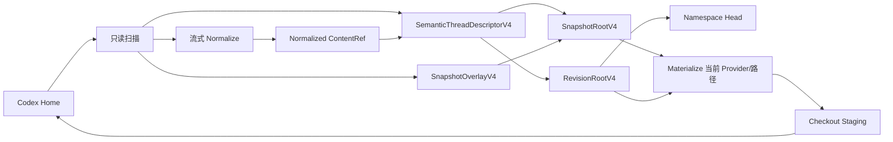
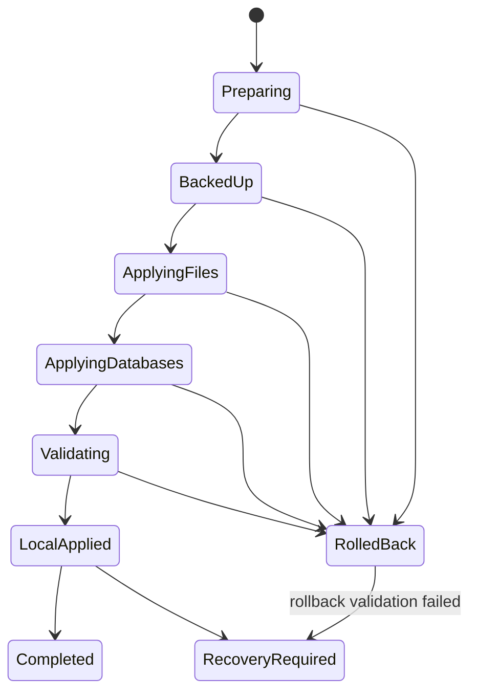

# Codex Session Sync v4 完整实施方案

状态：已确认，待实施  
更新时间：2026-08-04  
适用阶段：开发期破坏性升级  
适用仓库：`D:\codex-session-sync`

## 1. 执行摘要

本方案将本地快照和远端 Revision 统一到一套 v4 语义对象模型。rollout 在进入对象仓库前会被规范化为 Provider-neutral、workspace-neutral 内容；Provider、本机工作区路径等机器本地信息存入体积很小的本地 overlay，不再参与大文件内容哈希。

本地快照恢复、Pull、Namespace Switch 和冲突解决只承诺恢复相同的会话语义，不承诺恢复原 rollout 的逐字节表示。写入真实 Codex Home 时，客户端使用当前 `config.toml` Provider 和当前工作区映射生成新的本地 rollout。

开发阶段不兼容旧存储格式。实现和测试完成后，可以重置旧 `.codex-session-sync` 仓库、开发服务器 SQLite 和开发对象目录，但绝不修改或删除真实 `.codex` Home。

核心目标：

- 任意数量快照和 Revision 可以引用同一份规范化会话内容。
- 只改变 Provider 或本机工作区路径，不产生新的大 rollout 对象。
- 无变化 Push 不读取完整 rollout、不上传内容对象、不创建无意义 Revision。
- 任何真实 Home 写入都先建立可验证备份和持久化 operation journal。
- SQLite 文件永不进行二进制合并；始终导出、合并和导入线程级语义数据。

## 2. 已确认决策

1. 使用破坏性的 storage/protocol v4，不实现 v3 到 v4 迁移、双读、双写或兼容分支。
2. 旧本地对象仓库、旧开发服务器数据和旧测试数据没有保留价值，可以在最终验证后重置。
3. 真实 Codex Home 仍然是不可破坏边界；重置操作不得触及 `~/.codex`。
4. 本地快照恢复只要求语义一致，不要求 rollout 字节级一致。
5. 正常 Restore/Pull 使用当前 `config.toml` Provider；失败回滚可以使用 journal 中记录的操作前 Provider。
6. Provider 和本机路径不属于远端会话语义，不参与大内容对象哈希。
7. 第一版继续使用固定 4 MiB 分块，不立即引入 FastCDC。
8. Snapshot Root、Revision Root、Descriptor、Chunk Manifest 和 Chunk 都是不可变、SHA-256 校验的对象或根。
9. Completed 操作不长期保留原始 rollout 副本；长期恢复点使用规范化语义快照。
10. SQLite 在线备份只在操作执行和恢复窗口内保留；`RecoveryRequired` 状态除外。

## 3. 范围和非目标

### 3.1 本期范围

- v4 共享协议模型和本地对象图。
- Provider/workspace-neutral rollout 规范化。
- 本地 `SnapshotOverlayV4`。
- v4 Snapshot、Revision、Push、Pull、Switch、Restore 和冲突解决。
- Provider Sync 与 source index 协同。
- 统一 Home 写入备份、journal、rollback 和 restart recovery。
- v4 本地和服务端 GC、容量统计。
- 自动化测试、真实数据只读性能验证和开发数据重置。

### 3.2 非目标

- 不兼容任何 v1、v2 或 v3 仓库、Root、HTTP API 和服务器数据库。
- 不恢复原 JSON 字段顺序、空白、换行编码或 Provider 字符串的原始字节表示。
- 不同步 `auth.json`、API key、配置文件、插件、技能、MCP 配置、日志、worktree 或源码。
- 不同步 `thread_timeline_ledger`。
- 不合并 SQLite 二进制文件。
- 不在本阶段实现 FastCDC、压缩包格式或 S3 后端。
- 不开始跨平台安装包、签名、公证和自动更新工作。

## 4. 设计原则和不变量

### 4.1 内容身份

同一线程的规范化 rollout 只由同步范围内的语义内容决定：

```text
normalized_hash = SHA256(Normalize(raw_rollout))
```

下列变化不得改变 `normalized_hash`：

- `model_provider` 从 `custom` 改为 `freemodel`。
- Provider 改为同步占位值。
- 本机工作区从 `C:\work` 改为 `/Users/me/work`。
- SQLite 中的 `rollout_path`、`codex_home` 或 Provider 本地列改变。

下列变化必须改变线程语义 hash：

- 消息、工具调用、输出、压缩记录等同步内容改变。
- 标题、归档状态或同步范围内的 SQLite 子记录改变。
- 线程 UUID 改变。
- 语义工作区身份改变，而不是仅本机挂载路径改变。

### 4.2 规范化代数性质

规范化和物化必须满足：

```text
N(N(x)) = N(x)
N(Materialize(N(x), machine_context)) = N(x)
```

同一 normalization schema version 下，规范化必须完全确定，不能依赖当前时间、机器顺序、文件系统枚举顺序或远端状态。

### 4.3 写入安全

- 任意会修改真实 Home rollout 或 SQLite 的操作必须持有 per-home 独占写租约。
- 首次写入前必须确认 Codex 已完全关闭。
- 首次写入前必须存在已校验的操作前语义快照、SQLite 备份和 durable journal。
- 首次 Home 写入后，操作进入不可取消区，只能完成或回滚。
- rollback 后必须重新扫描并验证；不能只根据文件移动成功就宣称恢复完成。

## 5. v4 总体架构



本地快照和远端 Revision 共享 `SemanticThreadDescriptorV4` 与规范化内容对象。`SnapshotOverlayV4` 是本地专用对象，不上传服务器。

## 6. v4 数据模型

以下结构是逻辑模型，Rust 字段名继续使用 snake_case，JSON 使用 camelCase。

### 6.1 ContentRefV4

```text
ContentRefV4
  logicalSha256
  byteLength
  storage
    Whole { objectSha256 }
    Chunked { manifestSha256 }
  mediaType
  logicalPath
```

`logicalSha256` 始终是物化前规范化内容的 hash。`storage` 只是物理表示，Whole 和 Chunked 不得影响语义身份。

### 6.2 SemanticThreadDescriptorV4

```text
SemanticThreadDescriptorV4
  schemaVersion = 4
  normalizationSchemaVersion = 1
  threadId
  title
  archived
  createdAtMs
  updatedAtMs
  semanticWorkspace
    logicalId
    canonicalHint
  rollout: ContentRefV4
  relatedRecords
  attachments
```

约束：

- 不含 `modelProvider`。
- 不含本机绝对 `cwd`。
- 不含本机 SQLite 路径、`rollout_path` 或 `codex_home`。
- Descriptor 使用 canonical JSON，内容 hash 即 descriptor ID。
- attachments 若包含机器字段，必须经过各自的规范化器；没有规范化器时按原内容处理并明确记录媒体类型。

### 6.3 SnapshotOverlayV4

一个 snapshot 使用一个聚合 overlay 对象，避免每个线程增加单独对象和 Root 引用。

```text
SnapshotOverlayV4
  schemaVersion = 4
  normalizationSchemaVersion = 1
  threads: map<threadId, LocalThreadOverlayV4>

LocalThreadOverlayV4
  observedProvider
  localWorkspacePath
  localRolloutPath
  sourceDatabaseHints
  localFields
```

说明：

- `observedProvider` 用于审计、Provider Sync 预览和失败回滚；正常 Restore 使用当前 Provider。
- `localWorkspacePath` 用于本地快照详情和同机恢复提示；实际写入优先使用当前 workspace mapping。
- `sourceDatabaseHints` 只用于定位，不进入远端，也不作为恢复必须条件。
- `localFields` 只能保存经过 allowlist 的机器字段，不能成为任意 SQLite 行的无边界镜像。
- overlay 采用 canonical JSON 和内容寻址；100 个无变化快照应共享同一个 overlay 对象。

### 6.4 SnapshotRootV4

```text
SnapshotRootV4
  schemaVersion = 4
  snapshotId: UUIDv7
  createdAt
  threads: sorted Vec<ThreadRefV4>
  overlaySha256
  warningCount
```

`threads` 必须按 `threadId` 排序。Snapshot Root 是本地 manifest，不上传服务器。

### 6.5 RevisionRootV4

```text
RevisionRootV4
  schemaVersion = 4
  namespaceId: UUIDv7
  parentRevision
  createdAt
  threads: sorted Vec<ThreadRefV4>
  warningCount
```

```text
ThreadRefV4
  threadId
  descriptorSha256
```

Revision ID 是 `SHA256(canonical_json(RevisionRootV4))`。Revision 和所有被引用对象不可变。

### 6.6 ChunkManifestV4

```text
ChunkManifestV4
  schemaVersion = 4
  logicalSha256
  byteLength
  chunkSize = 4 MiB
  chunks: ordered Vec<{sha256, byteLength}>
```

除最后一块外，所有块必须恰好为 `chunkSize`。块总长度必须等于 `byteLength`。

## 7. 对象类型和目录

### 7.1 本地仓库

```text
.codex-session-sync/
├─ format.json
├─ objects/
│  ├─ whole/sha256/
│  ├─ chunks/sha256/
│  ├─ chunk-manifests/sha256/
│  ├─ threads/sha256/
│  ├─ revision-roots/sha256/
│  ├─ snapshot-overlays/sha256/
│  └─ tmp/
├─ snapshots/
├─ metadata/snapshots/
├─ index/source-objects-v4.json
├─ tracking/tracking.sqlite
├─ backups/
├─ journal/
├─ trash/snapshots/
├─ trash/gc/
└─ quarantine/
```

`snapshot-overlays` 是本地对象类型，不出现在远端 HTTP 对象类型列表中。

### 7.2 服务端仓库

```text
/data/
├─ metadata.sqlite
├─ objects/{whole,chunks,chunk-manifests,threads,revision-roots}/sha256/
├─ objects/tmp/
├─ trash/
└─ quarantine/
```

服务端不接受、存储或返回 snapshot overlay。

## 8. Rollout 规范化规范

### 8.1 固定 token

```text
PROVIDER_TOKEN  = "__codex_session_sync_local_provider_v4__"
WORKSPACE_TOKEN = "__codex_session_sync_local_workspace_v4__"
```

这两个值是系统保留值。Provider 校验必须拒绝用户配置成 Provider token；物化逻辑不能仅通过字符串猜测对象是否规范化，必须同时检查 descriptor schema。

### 8.2 JSONL 处理

规范化器逐行读取，不把完整 rollout 加载到内存。

1. 第一条有效记录必须是 `session_meta`，且 `payload.id` 必须等于目标 thread UUID。
2. 主 `session_meta.payload.model_provider` 替换为 `PROVIDER_TOKEN`。
3. 主 `session_meta.payload.cwd` 替换为 `WORKSPACE_TOKEN`。
4. rollout 中其他 `session_meta` 的 `model_provider` 也替换为 Provider token，以覆盖嵌入历史中多个 Provider 的情况。
5. 非主 `session_meta` 的 `cwd` 默认保留，除非后续明确证明它是机器本地字段。
6. 被修改的结构化记录使用 canonical JSON 输出，并保留原行的 LF/CRLF 终止形式。
7. 不属于已知 schema 的合法 JSON 行保持原字节。
8. 第一条记录之后的 malformed 行保持原字节并产生结构化 warning，不使整个线程扫描崩溃。
9. 第一条记录缺失、oversized、thread ID 不匹配或无法解析时，该 rollout 按现有兼容规则跳过并产生 warning。

规范化器必须同时计算：

- 规范化逻辑 SHA-256；
- 规范化逻辑长度；
- 分块 hash；
- Chunk Manifest；
- warning 列表。

不得先落一份完整 Whole 临时文件再重新分块。规范化输出直接进入 chunk sink，避免 Whole 和 Chunked 双份存储。

### 8.3 SQLite 语义投影

`relatedRecords` 只保留同步范围内的数据。投影至少执行：

- 移除 `model_provider`。
- 移除 `rollout_path`。
- 移除 `codex_home`。
- 将主线程 `cwd` 投影为 semantic workspace，而不是本机绝对路径。
- 移除已知的空列和可重建默认值。
- 保留直接外键引用 `threads` 的同步范围内子记录。
- 明确排除 `thread_timeline_ledger`。

所有表名和列名必须来自 SQLite schema inspection 和 allowlist，不能拼接不受信任标识符。

## 9. Source Index v4

```text
SourceObjectIndexV4
  schemaVersion = 4
  normalizationSchemaVersion = 1
  entries: map<canonicalSourcePath, Entry>

Entry
  byteLength
  modifiedUnixNanos
  optionalFileIdentity
  normalizedLogicalSha256
  normalizedByteLength
  storageRef
  observedProvider
  observedWorkspacePath
```

规则：

- source index 是可丢弃缓存，不是权威数据。
- 路径、长度、mtime、schema version 和物理对象完整性全部匹配时，允许不重读文件。
- 显式 Validate、Import、Checkout 验证不得信任 index，必须重新计算 hash。
- 文件发生变化时，第一版重新读取完整文件；不承诺增量读取。
- Provider Sync 成功后，因为规范化内容不变，可以在 journal 完成时原子回填新指纹到原 normalized ref。
- Provider Sync 失败或 rollback 后，根据最终文件指纹回填或删除对应 index entry。
- 外部程序改写 Provider 时，下一次 snapshot 必须重新读取文件，不能仅凭 Provider 推断内容未变。

## 10. 快照流程

创建快照是对 Home 的只读操作，但仍需 per-home snapshot lease 和 Codex 关闭确认，以获得一致的文件/SQLite 视图。

```text
确认 Codex 已关闭
  -> 扫描 rollout 与 SQLite 元数据
  -> 对每个 source 查询 Source Index
  -> 未命中时流式 Normalize + Chunk
  -> 生成/复用 Semantic Descriptor
  -> 生成/复用 Snapshot Overlay
  -> 写 SnapshotRootV4 临时文件并 fsync
  -> 原子替换 manifest
  -> 原子更新 Source Index
```

创建快照不需要 Home 备份，因为它不修改 Home。取消发生时只清理 `objects/tmp`；已经成功安装的不可变对象可以留给后续 GC。

## 11. Push 流程

```text
创建或加载最新 v4 Snapshot
  -> 将 semantic workspace 投影到目标远端语义
  -> 只重建必要的小 Descriptor，不改写 rollout
  -> 下载并验证当前 Head Root
  -> 比较线程语义集合
  -> 无变化：修复 Tracking 后返回 NoChanges
  -> 有变化：查询缺失对象
  -> 上传缺失对象
  -> 上传 RevisionRoot
  -> expectedHead + expectedNamespaceEpoch CAS Commit
  -> Tracking + active namespace 本地事务提交
```

约束：

- 普通 Push 不写真实 Home，因此不创建 Home 备份。
- 无变化 Push 上传 0 个 content object，并且不创建新 Revision。
- Push 重试只有在远端线程语义与待提交内容一致时，才能修复 Tracking。
- 上传对象在服务器安装前必须校验类型、长度和 SHA-256。

## 12. Pull、Switch 和 Restore 流程

所有会写真实 Home 的远端操作共用同一 checkout pipeline。

```text
下载并验证 Revision 图
  -> 三方合并或精确选择目标线程集合
  -> 读取当前 Provider
  -> 解析当前 workspace mapping
  -> 创建操作前语义快照
  -> 备份受影响 SQLite
  -> 写 durable journal
  -> 逐文件 Materialize 到 staging
  -> 原子替换 rollout
  -> SQLite 事务导入线程和子记录
  -> 维护 codex-dev.db 可重建 catalog
  -> 扫描并验证规范化语义 hash
  -> Tracking CAS + active namespace 同一事务提交
  -> journal Completed
  -> 清理临时备份与 staging
```

本地 Snapshot Restore 也使用这条 pipeline，只是没有远端 Tracking 更新。

## 13. Materialize 规范

Materialize 输入是 `SemanticThreadDescriptorV4`、规范化内容和当前机器上下文。

```text
MachineContext
  configuredProvider
  workspaceMappings
  targetCodexHome
```

处理规则：

1. 只解析 descriptor 声明的 normalization schema。
2. 将 Provider token 替换为当前 Provider。
3. 将主 workspace token 替换为映射后的当前本机路径。
4. 对没有 workspace mapping 且原路径不可用的线程，checkout 前要求用户明确选择路径。
5. 直接流式写入同一文件系统的 staging 文件。
6. 写入时计算物化 hash 和长度，记录到 journal，但语义验证使用重新规范化后的 hash。
7. staged 文件必须 `flush`、`sync_all` 并通过 JSONL 首记录验证后才能替换目标。

正常 Restore 不读取历史 overlay Provider。失败 rollback 可以使用操作前 overlay Provider，以恢复操作前可运行状态。

## 14. Provider Sync

Provider Sync 的职责是让真实 Home 中所有受支持 rollout 和 SQLite Provider 字段与当前 `config.toml` 一致。它不改变规范化对象、Snapshot 语义或远端 Revision。

### 14.1 执行流程

```text
Preview
  -> 确认 Codex 关闭并获取 Home 写租约
  -> 创建操作前语义快照
  -> 备份受影响 SQLite
  -> 写 journal
  -> 对每个 rollout：
       生成单文件 staging
       target -> .old
       staging -> target
       验证
       journal 更新
       删除 .old
  -> SQLite 事务更新 Provider
  -> 失效可重建 catalog
  -> 全 Home Provider 验证
  -> 回填 Source Index 新指纹到原 normalized ref
  -> journal Completed
  -> 删除临时 SQLite 备份
```

### 14.2 空间性质

- rollout staging 峰值与最大单 rollout 有关，而不是所有 rollout 总和。
- 已完成单文件的 `.old` 立即删除。
- 规范化操作前快照复用已有 chunks，不复制 Provider 特定大对象。
- SQLite 临时备份峰值仍是所有受影响数据库大小之和；不得宣称只等于最大数据库。

## 15. 统一备份模型

### 15.1 三层保护

1. **语义恢复点**：操作前 `SnapshotRootV4`，保护线程集合和 rollout 语义。
2. **SQLite 在线备份**：保护事务期间受影响数据库和本机非同步数据。
3. **Operation Journal**：连接文件系统替换、SQLite 事务和 Tracking 状态。

不可变对象仓库不制作整仓复制。服务器通过不可变对象、SQLite 事务、Revision trash 和 GC quarantine 保护。

### 15.2 需要 Home 备份的功能

| 功能 | 备份要求 |
|---|---|
| 本地 Snapshot Restore / Import | 语义恢复点、受影响 SQLite、journal |
| Pull | 语义恢复点、受影响 SQLite、checkout journal |
| Namespace Switch | 语义恢复点、受影响 SQLite、checkout journal |
| Remote Revision Restore | 语义恢复点、受影响 SQLite、checkout journal |
| Conflict Resolution | checkout 前完整备份 |
| Workspace Remap | 语义恢复点、SQLite 备份、journal |
| Provider Sync | 语义恢复点、SQLite 备份、逐文件 journal |
| Empty Rollout Quarantine | 隔离文件、原路径、hash 和 journal |
| Recovery 覆盖不一致现场 | 先创建 rescue recovery point |
| `codex-dev.db` catalog 变更 | 在线备份并保护非重建表 |

### 15.3 不需要 Home 备份的功能

| 功能 | 保护方式 |
|---|---|
| Scan、Preview、Diff、Validate | 只读 |
| 创建 Snapshot | 不可变对象和原子 Root 写入 |
| 普通 Push | 服务端对象校验和 Head CAS |
| Revision Download | 只写对象仓库 |
| Snapshot Trash / Restore Trash | 原子移动 Root 和 metadata |
| Local GC | quarantine，不直接永久删除 |
| Namespace Create / Rename | 服务端 SQLite 事务 |
| Remote History Truncate | namespace epoch、trash 和事务 |
| Profile、Mapping、Metadata | 原子配置写或内部 SQLite 事务 |
| Source Index | 可重建缓存 |
| Tracking | 内部 SQLite CAS 和 checkout journal |

### 15.4 备份保留策略

- 操作未终止：保留全部语义恢复点、SQLite 备份、staging、`.old` 和 journal。
- `RecoveryRequired`：不得自动删除任何恢复材料。
- 成功 `Completed`：先持久化终态，再删除 staging、`.old` 和临时 SQLite 备份。
- 成功操作前语义快照可作为 automatic recovery point 保留，由用户按普通 Snapshot 规则移入 trash。
- `RolledBack`：rollback 验证成功后可以删除临时 SQLite 备份；保留 journal 审计记录。
- 任何自动清理都不得永久删除 empty-rollout quarantine 项。

## 16. OperationJournalV4

```text
OperationJournalV4
  schemaVersion = 4
  operationId
  kind
  targetCodexHome
  repositoryRoot
  status
  preOperationSnapshotId
  targetRevision
  trackingUpdate
  filePlans
  databaseBackups
  startedAt
  updatedAt
  error

FilePlan
  threadId
  target
  beforeNormalizedRef
  beforeOverlay
  staged
  displaced
  expectedMaterializedHash
  status

DatabaseBackup
  target
  backup
  backupSha256
  quickCheckPassed
```

状态机：



规则：

- `BackedUp` 前允许取消。
- 首次 Home 写入后使用 non-cancellable control。
- journal 每次状态和文件步骤更新都必须原子写、flush 和 fsync。
- `LocalApplied` 状态不得在重启后盲目回滚；先比较 live semantic hash 和 Tracking generation。
- 发现现场既不匹配 before 也不匹配 target 时，先创建 rescue recovery point，再要求显式操作。

## 17. SQLite 写入策略

- 使用 SQLite online backup API，不复制正在打开的数据库文件。
- backup 完成后执行 `PRAGMA quick_check` 或等效校验。
- 修改线程表和直接子记录时使用 `BEGIN IMMEDIATE`。
- 每个数据库内线程更新必须是一个事务。
- 多数据库和文件系统操作由 journal 连接，不声称跨数据库 ACID。
- 导入前枚举实际表和列；未知必填列必须产生 unsupported schema 错误，不能猜默认值。
- `codex-dev.db` 只删除本机可重建 catalog 行、重置 full-scan watermark、递增 catalog revision。
- 必须保留 remote-host rows、automations、inbox、feature state 和 `thread_timeline_ledger`。

## 18. Merge 和冲突

三方合并继续以 thread UUID 为单位：

```text
base       = Tracking integrated Revision
local      = 当前 Snapshot 的 semantic thread set
remote     = 当前 Namespace Head thread set
```

- 不同 UUID 的修改自动合并。
- 同 UUID 单边修改自动接受。
- 同 UUID modify/modify、delete/modify 产生显式冲突。
- 冲突 fingerprint 绑定 base/local/remote 三个 semantic hash。
- 用户选择后必须重新扫描 local、重新读取 remote Head 并重新验证 fingerprint。
- 解决结果先通过安全 checkout 写入本地，再使用普通 Push CAS 发布。
- 不提供 force push，不静默选择 local 或 remote。

Provider 和本机路径不参与冲突判断。

## 19. 服务端 v4 协议

公开端点：

```text
GET /health
GET /api/v4/info
```

认证端点：

```text
GET/POST /api/v4/namespaces
PATCH /api/v4/namespaces/{id}
GET /api/v4/namespaces/{id}/head
GET /api/v4/namespaces/{id}/revisions
POST /api/v4/namespaces/{id}/revisions/commit
POST /api/v4/objects/missing
PUT/GET /api/v4/objects/{kind}/{sha256}
POST /api/v4/namespaces/{id}/history/truncations
GET /api/v4/namespaces/{id}/trash
POST /api/v4/namespaces/{id}/trash/{operation}/restore
GET /api/v4/storage
GET /api/v4/gc/plan
POST /api/v4/gc/quarantine
```

要求：

- 只有 health 和 protocol info 公开。
- 所有数据接口使用 Bearer token。
- redirect 默认拒绝。
- JSON/error response 有严格大小上限。
- Revision Commit 在 Head CAS 前递归验证完整 Root/Descriptor/Manifest/Chunk 图。
- Remote descriptor 不得包含 Provider token 以外的本地 Provider 值，也不得包含本机 overlay 引用。
- 最近上传对象进入短暂 GC grace period。

## 20. GC 和容量统计

### 20.1 本地可达根

- active Snapshot Roots；
- Snapshot trash；
- cached Revision Roots；
- active Snapshot Overlays；
- 非终止 journal 的 pre-operation Snapshot 和目标对象；
- RecoveryRequired 的全部对象引用。

### 20.2 服务端可达根

- 所有 active Namespace Head 可达 Revision；
- 未过期 Revision trash；
- pending commit/GC queue 保护对象；
- grace period 内最近上传对象。

### 20.3 删除规则

- Plan 阶段只读计算并生成 fingerprint。
- Execute 前重新计算可达集合并验证 fingerprint。
- 第一阶段只移动到 quarantine/trash。
- 不自动永久删除对象。
- empty-rollout quarantine 永不从 warning UI 永久删除。

### 20.4 容量指标定义

必须分别展示：

- `logicalBytes`：所有 Root 引用的逻辑内容之和，可重复计数。
- `activeReachablePhysicalBytes`：活动根可达物理对象去重后大小。
- `sharedPhysicalBytes`：被两个及以上活动根引用的对象。
- `exclusivePhysicalBytes`：只被一个活动根引用的对象。
- `backupBytes`：临时和 RecoveryRequired SQLite 备份。
- `trashBytes`：Snapshot/Revision trash。
- `quarantineBytes`：GC 和异常隔离区。
- `reclaimableBytes`：当前不可达且满足安全条件的对象。
- `repositoryPhysicalBytes`：整个仓库实际文件大小。

`1.15x` 空间目标只适用于 `activeReachablePhysicalBytes`，不能用于包含 backups、trash 和 quarantine 的整个目录。

## 21. 并发和租约

### 21.1 Home 租约

- Snapshot、Push 前一致性快照和所有 Home 写操作必须按规范化 Home key 串行化。
- 不同 Home 可以并行。
- React `busy` 只用于交互，不是同步边界。
- RAII guard 必须覆盖成功、失败、panic-safe cleanup 和取消。

### 21.2 Repository 租约

- 只读 list/validate/diff 使用 shared lease。
- Snapshot 写入和 immutable object install 可以使用受控 shared writer 或专用 object-store 并发机制。
- Snapshot trash、GC quarantine、格式重置使用 exclusive lease。
- 同一 hash 的并发对象安装必须幂等：目标存在时验证后丢弃临时文件。

### 21.3 Server gate

- 上传和普通读取使用 shared gate。
- GC mark/sweep 执行移动前使用 exclusive gate。
- Namespace Head 使用 SQLite `BEGIN IMMEDIATE` 和 expectedHead/epoch CAS。

## 22. 安全边界

- Raw API key 不保存、不上传、不经 IPC 返回。
- Bearer token 只存操作系统 credential backend。
- 自动 Namespace 映射只保存绑定服务器 URL 的本地 HMAC fingerprint。
- 本地 overlay 不上传服务器。
- 路径必须经过 canonicalization 和 selected Home containment 检查。
- rollout cleanup 只接受 selected Home 的 session 目录下、regular、non-symlink、zero-byte `rollout-*.jsonl`。
- 所有 JSON、对象、图深度、线程数、chunk 数和文件长度都有上限。
- 服务器和客户端都验证 SHA-256，不能信任对方声明。

## 23. 代码改造范围

| 模块 | 主要工作 |
|---|---|
| `crates/sync-core/src/models.rs` | v4 semantic model、overlay、runtime materialized model |
| `crates/sync-core/src/storage_v3.rs` | 替换为 v4 typed storage、Root 图、overlay、本地 GC |
| `crates/sync-core/src/provider.rs` | 合并到统一 normalizer/materializer，保留 Provider 检测 |
| `crates/sync-core/src/workspace.rs` | 从大对象改写转为 semantic workspace 与 materialize context |
| `crates/sync-core/src/local.rs` | v4 Snapshot、Source Index、备份和 Import adapter |
| `crates/sync-core/src/checkout.rs` | v4 journal、逐文件 staging、rollback/recovery |
| `crates/sync-core/src/provider_sync.rs` | 语义恢复点、逐文件处理、index handoff |
| `crates/sync-core/src/sync.rs` | v4 semantic hash、merge、Tracking 协调 |
| `crates/sync-core/src/protocol.rs` | v4 protocol models 和 limits |
| `apps/sync-server` | v4 API、数据库初始化、图验证、GC |
| `apps/desktop/src-tauri/src/remote.rs` | v4 HTTP client |
| `apps/desktop/src-tauri/src/remote_sync.rs` | 直接复用 normalized refs，统一 checkout |
| `apps/desktop/src-tauri/src/lib.rs` | 新命令边界、租约和 recovery dispatch |
| `apps/desktop/src` | 将“精确恢复”文案改为“语义恢复”，展示空间分项 |
| `README.md` | v4 架构、API、目录和安全边界 |

文件可在实施中重命名，例如将 `storage_v3.rs` 改为 `storage_v4.rs`。不要保留只为旧数据服务的类型别名。

## 24. 实施顺序

### Phase 0：测试基线和重置边界

- 记录当前测试基线。
- 增加 v4 format marker 和拒绝旧仓库的测试。
- 编写只针对临时目录的开发 reset helper 测试。
- 不删除任何真实数据。

完成标准：旧格式被明确拒绝，临时 v4 空仓库可初始化。

### Phase 1：v4 模型和规范化器

- 实现 `SemanticThreadDescriptorV4`、`SnapshotOverlayV4` 和 v4 Roots。
- 实现 streaming rollout normalizer/materializer。
- 实现直接 chunk sink，不生成中间 Whole 副本。
- 先写幂等、Provider、workspace、malformed 和 hash 测试。

完成标准：两个仅 Provider/本机路径不同的 rollout 得到相同 normalized hash。

### Phase 2：本地 Snapshot 和 Source Index

- Snapshot 创建直接存 normalized content。
- 本地 Root 引用 shared descriptor 和 aggregate overlay。
- Source Index 升级 v4。
- Validate 始终全量 hash。

完成标准：100 个无变化 Snapshot 不新增 rollout/descriptor/overlay 对象。

### Phase 3：Materialize、Backup 和 Checkout

- 实现 MachineContext。
- 接入本地 Snapshot Restore/Import。
- 实现 `OperationJournalV4`、语义恢复点和 SQLite 临时备份。
- 逐文件 staging、rollback 和 restart recovery。

完成标准：故障注入覆盖每个 journal 状态，并能完成或可靠进入 `RecoveryRequired`。

### Phase 4：服务端和远端协议 v4

- 初始化全新 v4 metadata SQLite。
- 替换 HTTP 路由、object kinds 和 graph validation。
- 更新 desktop remote client。
- 保留 Bearer auth、limits、CAS 和 GC grace period。

完成标准：服务端拒绝旧 Root、overlay 和非法图，v4 commit/restart 测试通过。

### Phase 5：Push/Pull/Switch/Conflict

- Push 直接引用 normalized content。
- Pull 和 Switch 进入统一 materialize checkout。
- Conflict 使用 v4 semantic hash。
- Tracking 和 active namespace 保持 CAS。

完成标准：双 Home loopback、同 UUID 冲突和发布失败重试全部通过。

### Phase 6：Provider Sync 和 Workspace Remap

- Provider Sync 使用操作前语义恢复点。
- 成功后 source index handoff。
- Workspace Remap 不再创建新的大 rollout 对象。
- 更新 UI 预览和空间说明。

完成标准：Provider/path-only 操作不增加 normalized rollout objects。

### Phase 7：GC、统计和 UI

- 本地/服务器 GC 识别 v4 overlay 和 journal roots。
- 容量统计拆分 active、backup、trash、quarantine。
- UI 将“精确恢复”改为“语义恢复”。
- 更新 preview mocks 和 Vitest。

完成标准：GC 不回收任何活动或恢复所需对象，空间指标与磁盘扫描一致。

### Phase 8：全量验证和开发数据重置

- 执行完整 Rust、server、desktop 和 frontend 验证。
- 使用临时 Home 完成端到端验收。
- 对真实 Home 只做只读 scan/snapshot 性能试验。
- 用户明确确认后重置旧本地仓库和开发服务器数据。
- 使用 v4 创建首个真实 Snapshot 和 Push。

完成标准：所有验收指标通过，真实 `.codex` 未被开发重置修改。

## 25. 测试计划

### 25.1 Normalization 单元测试

- `custom`、`freemodel`、`openai` 得到相同 normalized bytes/hash。
- 主 `cwd` 在 Windows、macOS、Linux 路径下得到相同 hash。
- 同一 JSON 不同字段顺序得到相同已修改 `session_meta` 输出。
- 多个 `session_meta` 的 Provider 全部规范化。
- 非主 `session_meta.cwd` 按规则保留。
- 非 session-meta 用户文本中的 `model_provider` 不被修改。
- malformed 后续行原样保留并产生 warning。
- invalid UTF-8、empty、missing meta、oversized、thread ID mismatch。
- LF、CRLF 和无末尾换行。
- `N(N(x)) = N(x)`。
- `N(Materialize(N(x))) = N(x)`。

### 25.2 Storage 单元测试

- Whole/Chunked 语义等价。
- 4 MiB 边界：`4MiB-1`、`4MiB`、`4MiB+1`。
- Chunk Manifest 长度、顺序和 hash 校验。
- Descriptor、Root、Overlay canonical hash 稳定。
- 非法 object kind、超限对象、图深度和引用数。
- 并发安装同 hash 幂等。
- transform 不留下完整 Whole 临时副本。

### 25.3 Snapshot 和 Index 测试

- 无变化 snapshot 命中 index，不读取完整 rollout。
- mtime/length/schema/object 缺失使 index 失效。
- Validate 即使 index 命中也能发现损坏。
- Provider Sync 成功回填新指纹。
- Provider Sync rollback 后 index 与最终文件一致。
- 100 个相同 Snapshot 的空间增量测试。

### 25.4 Backup 和 Recovery 测试

- 首次写入前 backup 和 journal 已 durable。
- SQLite backup `quick_check` 失败时零 Home 写入。
- 每个 journal 状态的 crash injection。
- 单文件替换前、中、后崩溃。
- SQLite apply 失败自动 rollback。
- rollback 验证失败进入 `RecoveryRequired`。
- `LocalApplied` 重启后正确完成 Tracking 或保留现场。
- rescue recovery point 覆盖分叉现场。
- 非重建 `codex-dev.db` 数据保持不变。

### 25.5 Server/API 测试

- 未认证请求零写入。
- hash、length、size、kind 和 graph rejection。
- first commit、fast-forward、幂等 retry、stale Head/Epoch。
- 并发提交只有一个成功。
- orphan Revision 不可见。
- restart persistence。
- history trash/restore 和 server GC。
- overlay 上传被拒绝。

### 25.6 端到端测试

- A Push -> B Switch -> B Push -> A Pull。
- A/B 不同 Provider 和不同本机路径，远端 normalized hash 相同。
- 同 UUID 双边修改 -> 显式选择 -> checkout -> CAS Push。
- publish 失败留下可重试本地变更。
- 无变化 Push 上传 0 内容对象。
- Namespace history rewrite 后旧客户端被 epoch 拒绝。

### 25.7 大数据测试

基于当前约 418 个线程、约 984,811,738 rollout bytes 的量级构造或只读使用测试数据：

- 首次 Snapshot 的吞吐、峰值内存和对象大小。
- 第二次无变化 Snapshot 的读取字节数。
- Provider-only Sync 后 Snapshot 的读取和空间增量。
- 单线程追加后的 chunks 增量。
- 100 个 Snapshot Root 的总增量。

真实 Home 测试只读；所有写入、Pull、Restore 和冲突测试使用临时 Home。

## 26. 验收指标

以约 1.053 GiB Codex Home、418 个线程为当前基准：

| 指标 | 目标 |
|---|---:|
| 首次 active reachable object bytes | 不超过 rollout 语义内容约 1.15x |
| 100 个无变化 Snapshot 新增空间 | 不超过 10 MiB |
| 仅切换 Provider 后新增 normalized content | 0 bytes |
| Provider-only Snapshot 总新增空间 | 不超过 5 MiB |
| 无变化 Push 上传 content objects | 0 |
| Provider/path-only Push 创建 Revision | 否 |
| 单线程追加 | 只新增变化尾块、Manifest、Descriptor、Root |
| Snapshot 数量增长 | 不复制完整 rollout |
| Normalizer 峰值内存 | O(chunk size + max metadata line) |
| Provider Sync rollout 临时空间 | O(max rollout file) |
| SQLite 临时备份空间 | 所有受影响 DB 大小之和，单独统计 |

说明：

- 固定分块追加会重建原最后一个非满块；“只新增尾块”包含这个例外。
- 第一版变更文件仍可全量读取；验收约束存储增量，不假设增量读取。
- backups、trash、quarantine 不计入 active reachable `1.15x`，但必须分别展示。

## 27. 开发数据重置方案

重置是最终验证后的单独人工步骤，不属于普通应用启动迁移。

### 27.1 可重置目标

- 当前用户明确选择的 `.codex-session-sync` 开发仓库。
- 本项目开发服务器的数据目录或 Docker Compose 开发 volume。
- 测试 fixtures 和临时数据库。

### 27.2 禁止目标

- `~/.codex`。
- `sessions`、`archived_sessions`、`sqlite/*.db`、`state_5.sqlite` 所在真实 Home。
- 未经明确选择的其他用户目录或 Compose volume。

### 27.3 重置步骤

1. 完整测试通过。
2. 确认 Codex 完全关闭。
3. 解析并显示待重置绝对路径、文件数和字节数。
4. 验证目标 basename 是 `.codex-session-sync`，且目标不是 Codex Home 或其父目录。
5. 默认先移动到带时间戳的开发隔离目录；只有再次确认后才永久删除。
6. 重新初始化空 v4 仓库和服务端数据库。
7. 对真实 Home 做只读 scan。
8. 创建首个 v4 Snapshot。
9. Push 到全新 Namespace。
10. 使用临时第二 Home 验证 Pull/Restore。

应用不得在发现旧格式时自动删除数据；应明确提示“开发格式不兼容，需要人工重置”。

## 28. 最终验证命令

```powershell
cargo fmt --all -- --check
cargo test --workspace
cargo check --workspace
cargo clippy --workspace --all-targets -- -D warnings

cd apps/desktop
npm run check
npm run build
npm test -- --run
```

附加验证：

```powershell
cargo test -p sync-core normalization
cargo test -p sync-core checkout
cargo test -p sync-core provider_sync
cargo test -p sync-server --test api
```

原生凭据 smoke test 继续保持 ignored，按现有说明显式运行。

## 29. 完成定义

只有同时满足以下条件，v4 才算完成：

1. 本地 Snapshot 和远端 Revision 共享同一 Semantic Descriptor 和 normalized rollout。
2. Provider 和本机路径不参与大 rollout 对象 hash。
3. Restore/Pull 使用当前 Provider，并通过重新规范化验证语义一致。
4. 所有真实 Home 写操作都具有自动化 backup、rollback、validation 和 restart recovery 测试。
5. 无变化 Snapshot、Provider-only Snapshot、无变化 Push 和追加场景通过空间验收。
6. 本地和服务端 GC 不回收活动、trash 或 journal 保护对象。
7. v4 API、server restart、Tracking CAS、conflict 和 namespace epoch 测试通过。
8. UI 明确使用“语义恢复”表述，不再承诺字节级精确恢复。
9. 全 workspace fmt、test、check、clippy 和 frontend 验证全部通过。
10. 开发数据重置经过单独确认，真实 Codex Home 未被重置或开发验证写入。

## 30. 实施结论

本方案通过“规范化语义内容 + 本地 overlay + 不可变对象图”消除 Provider 和本机路径造成的大文件重复，通过“操作前语义恢复点 + SQLite 在线备份 + durable journal”保证真实 Home 写入安全。

开发阶段直接采用 v4 破坏性格式可以删除迁移和兼容复杂度，但不能降低真实 Home 的备份、验证和恢复标准。实施时应优先完成规范化不变量、备份状态机和故障注入测试，再接入 UI 与开发数据重置。
