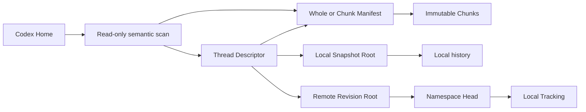

# Codex Session Sync v2 版本历史、快照与恢复实施计划

> 状态：待实施  
> 更新日期：2026-07-31  
> 适用仓库：`F:\codex-session-sync`  
> 目标版本：开发期 Storage/Remote Protocol v2-only 版本

## 1. 文档目的

本文档定义以下功能的完整实施流程：

- 将当前过渡中的存储实现收口为唯一的 v2 分块对象图。
- 将远端 Revision 改为紧凑 Root/Descriptor 模型。
- 为“同步”页面增加类似 IntelliJ IDEA Git Log 的版本图谱。
- 新增一级“快照与恢复”页面。
- 提供本地快照、远端命名空间 Revision、操作恢复点和回收站列表。
- 提供验证、比较、精确恢复、增量导入、恢复并发布等操作。
- 提供安全的本地删除、远端历史回退和对象垃圾回收。
- 提供空间统计、固定快照和保留策略。

本项目仍然使用语义线程合并，不使用 Git 合并 Codex SQLite 文件。

## 2. 已确认的项目决策

### 2.1 开发阶段数据策略

当前项目尚未进入生产使用，因此不保留开发期同步仓库和开发服务器数据兼容性。

可以重置的数据：

- `C:\Users\24989\.codex-session-sync`。
- 开发服务器的 `data` 目录。
- Docker Compose 开发数据卷。
- 开发期间创建的 Snapshot、Revision、Tracking 和对象缓存。

绝对不能作为开发数据清理的数据：

- `C:\Users\24989\.codex` 及其他真实 Codex Home。
- 真实 rollout 文件。
- 真实 Codex SQLite 数据库。
- `auth.json`、API Key、配置、插件、技能和 MCP 配置。

任何开发数据重置必须将同步仓库和真实 Codex Home 视为两个完全独立的目标。

### 2.2 不再支持 v1 数据格式

最终实现只支持：

- Storage Protocol v2。
- 强制 `StorageRef` 的 `ContentRef`。
- 紧凑 `SnapshotRootV2`。
- 紧凑 `RevisionRootV2`。
- Whole、Chunk、ChunkManifest、ThreadDescriptor、RevisionRoot 类型化对象。

删除以下兼容路径：

- `snapshots/*.json` 旧版完整快照格式。
- `snapshots/v1`。
- `objects/sha256` 旧整对象目录。
- `ContentObject.storage = None`。
- legacy object Push/Pull。
- v1 快照优化和迁移代码。
- v1 快照、Revision 和对象接口测试。

### 2.3 暂不实施跨平台打包

本计划不包含：

- Windows 安装包发布。
- macOS 签名和公证。
- Linux AppImage/deb 发布。
- 自动更新。
- 发布渠道和版本升级迁移。

跨平台打包在本功能完成并稳定后重新排期。

### 2.4 删除语义

- 删除不是直接永久删除。
- 本地 Snapshot 先进入本地回收站。
- 远端 Revision 历史先进入服务器回收站。
- 对象必须在所有权威根中均不可达后才能进入 GC 隔离区。
- GC 第一阶段只隔离，不永久删除。
- 永久删除需要独立确认或明确启用的保留策略。

### 2.5 远端恢复语义

恢复旧 Revision 的默认操作是创建一个新的快进 Revision，类似 Git revert，而不是改写历史。

只有明确选择“回退远端 Head”时才允许历史改写。

## 3. 非目标

本阶段不实现：

- v1/v2 混合数据兼容。
- 新客户端连接旧协议服务器。
- 多用户权限和共享账户。
- S3 对象存储实现，只保留适配器边界。
- 自动永久删除作为默认行为。
- 多父 Merge Revision；当前远端历史仍为单父线性历史。
- SQLite 二进制文件合并。
- 同步 `auth.json`、API Key、配置、插件、技能、MCP、日志、源码和 worktree。

## 4. 术语

| 术语 | 含义 |
|---|---|
| Working Tree | 当前真实 Codex Home 的语义线程状态 |
| Local Snapshot | 本地同步仓库中的不可变快照 Root |
| Thread Descriptor | 一个线程的不可变语义元数据与内容引用 |
| Revision Root | 远端命名空间中一个不可变 Revision 的紧凑根对象 |
| Tracking Head | 本机最后成功整合的远端 Revision |
| Remote Head | 服务器命名空间当前 Revision |
| Namespace Epoch | 远端命名空间历史被改写的代次 |
| Tracking Generation | 本地 Tracking SQLite 行的 CAS 代次，与 Namespace Epoch 不同 |
| Logical Hash | 完整 rollout 内容的 SHA-256 |
| Physical Object | Whole、Chunk、Manifest、Descriptor 或 Root 文件 |
| Reclaimable Bytes | 删除指定根后、经全局引用计算可安全隔离的物理字节数 |

## 5. 目标架构



### 5.1 本地仓库布局

```text
.codex-session-sync/
├─ objects/
│  ├─ whole/sha256/<prefix>/<digest>
│  ├─ chunks/sha256/<prefix>/<digest>
│  ├─ chunk-manifests/sha256/<prefix>/<digest>
│  ├─ threads/sha256/<prefix>/<digest>
│  ├─ revision-roots/sha256/<prefix>/<digest>
│  └─ tmp/
├─ snapshots/
│  └─ <snapshot-id>.json
├─ snapshot-meta/
│  └─ <snapshot-id>.json
├─ backups/
├─ journal/
├─ trash/
│  ├─ snapshots/
│  └─ gc/<operation-id>/
├─ quarantine/
└─ index/
   └─ source-objects-v2.json
```

### 5.2 服务端布局

```text
/data/
├─ metadata.sqlite
├─ objects/
│  ├─ whole/
│  ├─ chunks/
│  ├─ chunk-manifests/
│  ├─ threads/
│  └─ revision-roots/
├─ trash/
├─ gc/
└─ tmp/
```

## 6. v2 核心数据模型

### 6.1 ContentRef

`StorageRef` 必须存在，不再使用 `Option<StorageRef>`。

```rust
pub struct ContentRef {
    pub logical_sha256: String,
    pub byte_length: u64,
    pub storage: StorageRef,
    pub media_type: Option<String>,
    pub logical_path: Option<String>,
}
```

### 6.2 StorageRef

```rust
pub enum StorageRef {
    Whole {
        object_sha256: String,
    },
    Chunked {
        manifest_sha256: String,
    },
}
```

### 6.3 ThreadDescriptor

```rust
pub struct ThreadDescriptor {
    pub schema_version: u32,
    pub thread_id: String,
    pub title: String,
    pub archived: bool,
    pub created_at_ms: Option<i64>,
    pub updated_at_ms: Option<i64>,
    pub model_provider: Option<String>,
    pub workspace: WorkspaceRef,
    pub rollout: ContentRef,
    pub related_records: RelatedRecords,
    pub attachments: Vec<ContentRef>,
}
```

Thread Descriptor 的对象 ID 是其规范化 JSON 的 SHA-256。

### 6.4 SnapshotRootV2

```rust
pub struct SnapshotRootV2 {
    pub schema_version: u32,
    pub snapshot_id: String,
    pub created_at: String,
    pub threads: Vec<ThreadRef>,
    pub warning_count: usize,
}
```

本地 Snapshot ID 继续使用 UUIDv7。Snapshot Root 文件自身不以 Snapshot ID 作为内容哈希身份。

### 6.5 RevisionRootV2

```rust
pub struct RevisionRootV2 {
    pub schema_version: u32,
    pub namespace_id: Uuid,
    pub parent_revision: Option<String>,
    pub created_at: String,
    pub threads: Vec<ThreadRef>,
    pub warning_count: usize,
}
```

Revision ID 定义为：

```text
sha256(canonical_json(RevisionRootV2))
```

Revision ID 与 Revision Root 类型化对象哈希相同。

### 6.6 SnapshotMetadata

用户可变信息不能写入不可变 Root。

```rust
pub struct SnapshotMetadata {
    pub schema_version: u32,
    pub snapshot_id: String,
    pub label: Option<String>,
    pub pinned: bool,
    pub origin: SnapshotOrigin,
    pub source_remote_id: Option<Uuid>,
    pub source_namespace_id: Option<Uuid>,
    pub source_revision_id: Option<String>,
    pub created_at: String,
    pub updated_at: String,
}
```

元数据使用原子 JSON 替换保存。

## 7. 统一远端 API v2

除健康检查和协议信息外，所有接口必须要求 Bearer Token。

### 7.1 公共接口

```http
GET /health
GET /api/v2/info
```

### 7.2 Namespace

```http
GET    /api/v2/namespaces
POST   /api/v2/namespaces
PATCH  /api/v2/namespaces/{namespaceId}
GET    /api/v2/namespaces/{namespaceId}/head
```

Namespace 响应增加：

```json
{
  "id": "...",
  "displayName": "Personal",
  "head": "sha256:...",
  "namespaceEpoch": 0,
  "createdAt": "...",
  "updatedAt": "..."
}
```

### 7.3 类型化对象

```http
POST /api/v2/objects/missing
PUT  /api/v2/objects/{kind}/{sha256}
GET  /api/v2/objects/{kind}/{sha256}
```

对象身份必须使用 `(kind, sha256)`，不同 kind 的相同 SHA-256 不是同一个对象。

### 7.4 Revision 列表和详情

```http
GET /api/v2/namespaces/{namespaceId}/revisions?limit=100&cursor=...
GET /api/v2/revisions/{revisionId}
```

列表返回摘要，不返回完整线程：

```json
{
  "namespaceId": "...",
  "head": "sha256:...",
  "namespaceEpoch": 0,
  "items": [
    {
      "revisionId": "sha256:...",
      "parentRevision": "sha256:...",
      "createdAt": "...",
      "threadCount": 418,
      "addedCount": 2,
      "modifiedCount": 1,
      "deletedCount": 0,
      "logicalBytes": 984811738,
      "physicalReferencedBytes": 30214720
    }
  ],
  "nextCursor": null
}
```

### 7.5 Revision Commit

```http
POST /api/v2/namespaces/{namespaceId}/revisions/commit
```

```json
{
  "expectedHead": "sha256:...",
  "expectedNamespaceEpoch": 0,
  "revisionRootSha256": "sha256:..."
}
```

服务端提交顺序：

1. 验证命名空间存在。
2. 验证 Head 和 Namespace Epoch。
3. 读取并验证 Revision Root。
4. 验证 Root namespace ID 与路由一致。
5. 验证 Root parent 与 expected Head 一致。
6. 验证 ThreadRef 唯一、排序和 Descriptor Hash。
7. 验证所有 Descriptor、Manifest 和 Chunk 存在。
8. 验证对象长度、对象 Hash 和逻辑内容身份。
9. 在 `BEGIN IMMEDIATE` 中写入 Revision 元数据并更新 Head。
10. 返回幂等提交结果。

同一 Root 的重复提交必须幂等。过期 Head 或 Epoch 必须返回冲突且不得改变元数据。

### 7.6 历史回退和回收站

```http
POST   /api/v2/namespaces/{namespaceId}/history/truncations
GET    /api/v2/namespaces/{namespaceId}/trash
POST   /api/v2/namespaces/{namespaceId}/trash/{operationId}/restore
DELETE /api/v2/namespaces/{namespaceId}/trash/{operationId}
```

历史回退请求：

```json
{
  "expectedHead": "sha256:...",
  "expectedNamespaceEpoch": 0,
  "newHead": "sha256:..."
}
```

服务端必须验证 `newHead` 是当前 Head 的祖先或 `null`。

成功后：

- 更新 Head。
- `namespaceEpoch += 1`。
- 将被截断 Revision 标记为回收站历史。
- 仍保留其 Root 和所有对象。

## 8. 服务端 SQLite 目标结构

建议将 metadata schema 升级为新的开发期版本，不提供旧库迁移，开发服务器重置后创建新库。

### 8.1 namespaces

```text
id
display_name
head_revision
namespace_epoch
created_at
updated_at
```

### 8.2 revisions

```text
id
namespace_id
parent_revision
root_sha256
created_at
thread_count
added_count
modified_count
deleted_count
logical_bytes
physical_referenced_bytes
state
trash_operation_id
```

### 8.3 storage_objects

```text
kind
sha256
byte_length
created_at
validation_state
```

### 8.4 object_edges

```text
owner_kind
owner_sha256
target_kind
target_sha256
```

### 8.5 revision_trash_operations

```text
id
namespace_id
old_head
new_head
epoch_before
epoch_after
created_at
expires_at
state
```

### 8.6 gc_queue

```text
id
object_kind
object_sha256
expected_length
not_before
attempt_count
last_error
state
```

## 9. Tracking 模型调整

本地 Tracking 记录必须区分本地 CAS generation 和远端 epoch：

```text
codex_home_key
remote_id
namespace_id
integrated_head
remote_epoch
generation
updated_at
```

规则：

- `generation` 只用于本地 Tracking 行 CAS。
- `remote_epoch` 来自服务器 Namespace Epoch。
- 普通快进 Push/Pull 不改变 Namespace Epoch。
- 远端历史回退会改变 Namespace Epoch。
- 本机发现 Epoch 不一致时禁止普通 Pull 和 Push。
- 用户必须选择精确接受远端、重新发布本地状态或切换命名空间。

## 10. 本地 Snapshot API 与 Tauri 命令

新增命令：

```text
list_local_snapshots
get_local_snapshot_details
create_local_snapshot_job
validate_local_snapshot_job
compare_local_snapshot_job
restore_local_snapshot_job
import_missing_threads_job
update_snapshot_metadata
trash_local_snapshot_job
restore_trashed_snapshot_job
list_local_trash
list_recovery_points
plan_local_gc_job
quarantine_local_gc_job
get_repository_storage_summary
```

所有可能读取或修改 Repository 对象图的任务必须获取 Repository Lease。

所有修改真实 Codex Home 的任务还必须：

- 获取 per-home lease。
- 确认 Codex 完全关闭。
- 检测 Codex Desktop/CLI 进程。
- 写入前创建 backup 和 journal。
- 写入后执行语义验证。
- 失败时自动回滚。

## 11. Repository Lease

新增 Repository 级读写租约：

| 操作 | Home Lease | Repository Lease |
|---|---|---|
| 查看列表 | 无 | 共享 |
| 查看详情/Diff | 无 | 共享 |
| 创建快照 | 独占 Home | 共享 Repository |
| 验证快照 | 无 | 共享 |
| Push/Pull | 独占 Home | 共享 Repository |
| 精确恢复 | 独占 Home | 共享 Repository |
| 移入回收站 | 无真实 Home 写入 | 独占 Repository |
| GC Plan | 无 | 共享 Repository |
| GC 隔离 | 无 | 独占 Repository |
| 仓库数据重置 | 无 | 独占 Repository |

React `busy` 状态不能作为同步边界。

## 12. IDEA 风格同步页面

### 12.1 页面结构

```text
顶部工具栏
├─ 远程服务器
├─ 命名空间
├─ 刷新状态
├─ Push
├─ Pull
└─ 切换命名空间

左侧来源树
├─ Working Tree
├─ Tracking
└─ Remote namespaces

中间版本图谱
├─ Graph
├─ Revision 描述
├─ 标签
├─ 时间
└─ 会话变化

底部详情
├─ 摘要
├─ 会话 Diff
├─ 对象信息
└─ 操作
```

### 12.2 图谱节点

- 远端 Revision：实心圆。
- 本地 Working Tree：空心圆。
- 本地 Snapshot：空心圆加 Snapshot 标签。
- Tracking：`TRACKING` 标签。
- Remote Head：`HEAD` 标签。
- 冲突：警告标签和分叉线。

### 12.3 同步状态矩阵

| Working Tree | Tracking | Remote Head | 主操作 |
|---|---|---|---|
| 相同 | 相同 | 相同 | 已是最新 |
| 已修改 | 等于 Remote | 等于 Tracking | Push |
| 等于 Tracking | 落后 | 领先 | Pull |
| 已修改 | 共同基线 | 远端领先 | Pull 并合并 |
| 同线程冲突 | 共同基线 | 远端领先 | 解决冲突 |
| 非活动命名空间 | 任意 | 任意 | 切换命名空间 |
| Epoch 不一致 | 旧 Epoch | 新 Epoch | 历史协调 |

进入同步页面不能自动创建快照。Working Tree 状态必须显示扫描时间和是否过期。

## 13. 快照与恢复页面

新增一级路由：

```text
/history
/history/snapshots
/history/recovery
/history/trash
```

### 13.1 来源树

```text
本机
├─ 全部快照
├─ 手动快照
├─ 自动安全快照
├─ 已固定
└─ 操作恢复

服务器
├─ Personal
├─ Work
└─ Test

回收站
├─ 本地快照
└─ 远端历史
```

### 13.2 列表列

```text
Graph
描述
标签
创建时间
会话变化
会话总数
逻辑大小
物理引用大小
预计可回收空间
状态
```

精确可回收空间只在选中版本或打开删除确认时计算，不作为首屏阻塞查询。

### 13.3 本地快照操作

- 创建。
- 验证。
- 修改标签。
- 固定/取消固定。
- 与 Working Tree 比较。
- 与其他 Snapshot 比较。
- 精确恢复。
- 仅导入缺失线程。
- 移入回收站。

### 13.4 远端 Revision 操作

- 查看详情。
- 与 Working Tree 比较。
- 与父 Revision 比较。
- 下载为本地 Snapshot。
- 恢复为本地待 Push 状态。
- 恢复并发布为新 Revision。
- 回退 Remote Head 到此处。
- 删除当前 Head。

默认高亮“恢复并发布为新 Revision”；历史回退放在高级危险操作中。

### 13.5 操作恢复

自动发现：

- Import Journal。
- Checkout Journal。
- Sync/Conflict Journal。
- GC Journal。
- 对应 Backup。

未完成操作置顶。外部 Journal 文件选择保留为次级兼容入口，不作为主流程。

## 14. 本地删除流程

### 14.1 生成删除计划

删除前生成：

```rust
pub struct SnapshotDeletionPlan {
    pub snapshot_id: String,
    pub manifest_path: PathBuf,
    pub pinned: bool,
    pub protected_by_operations: Vec<String>,
    pub shared_object_count: usize,
    pub exclusive_object_count: usize,
    pub reclaimable_after_trash_expiry: u64,
}
```

以下情况拒绝删除：

- Snapshot 已固定。
- Snapshot 被非终态 Journal 引用。
- Snapshot 正被任务使用。
- Snapshot 清单或 Root 校验失败。
- Repository Lease 无法获取。

### 14.2 移入回收站

1. 获取 Repository 独占租约。
2. 重新验证删除计划。
3. 创建删除 Journal。
4. 原子移动 Snapshot Root。
5. 原子移动 SnapshotMetadata。
6. 写入回收站条目。
7. 更新 Journal 为完成。
8. 不删除任何对象。

### 14.3 恢复

恢复时重新检查 Snapshot ID 冲突。若活动区已经存在同 ID 但内容不同，必须拒绝恢复。

## 15. 本地 GC

### 15.1 权威根

Mark 阶段必须包含：

- 活动 Snapshot Root。
- 未过期的回收站 Snapshot Root。
- 非终态 Journal 引用的 Root。
- 正在运行任务持有的 Root。
- 明确固定的临时恢复 Root。

### 15.2 对象图遍历

```text
Snapshot Root
  → Thread Descriptor
    → Whole
    → Chunk Manifest
      → Chunk
    → Attachments
```

每种对象使用 `(kind, sha256)` 作为唯一身份。

### 15.3 两阶段 GC

第一阶段：

- 生成 GC Plan。
- 获取独占 Repository Lease。
- 重新计算权威可达性。
- 将仍不可达的对象移动到 `trash/gc/<operation-id>`。
- 保存完整 Journal。

第二阶段：

- 等待保留期。
- 再次确认对象未恢复引用。
- 用户明确确认或保留策略允许。
- 永久删除 GC 隔离目录。

## 16. 远端历史回退与 GC

### 16.1 活动 Revision 根

服务器必须从每个 Namespace Head 沿 parent 链标记所有活动 Revision。

每个活动 Revision 的 Root 都是对象图根。未过期的远端回收站 Revision 也必须作为根。

### 16.2 服务端 GC

1. 在 SQLite 事务中生成逻辑删除和 GC 候选。
2. 将候选写入持久化 `gc_queue`。
3. 后台任务逐项重新检查全局引用。
4. 对象无引用时移动到服务器隔离区。
5. 成功后更新队列状态。
6. 重启后继续未完成队列。

不能先删除文件再提交 SQLite 状态。

### 16.3 跨命名空间共享

同一个 Chunk、Manifest 或 Thread Descriptor 可能被多个 Namespace 引用。删除一个 Namespace 的历史不能删除其他 Namespace 仍可达的对象。

## 17. 空间统计

提供：

```text
logicalBytes
activePhysicalBytes
sharedPhysicalBytes
exclusivePhysicalBytes
trashBytes
gcQuarantineBytes
reclaimableBytes
protectedByJournalBytes
```

注意：

- 逻辑大小不能直接相加作为磁盘占用。
- 相同 Chunk 在多个 Snapshot/Revision 中只计一次物理空间。
- 相同 Hash 但不同 StorageObjectKind 必须分别计数。

## 18. 默认保留策略

第一版自动永久清理默认关闭。

建议默认值：

| 类型 | 默认策略 |
|---|---|
| 手动 Snapshot | 永久保留 |
| 固定 Snapshot | 永久保留 |
| 自动安全 Snapshot | 最近 10 份或 30 天 |
| 已完成 Backup | 7 天 |
| 未完成 Journal | 永久保留直到处理 |
| 本地回收站 | 7 天 |
| 远端回收站 | 7 天 |
| GC 隔离区 | 手动永久清理 |
| 活动远端历史 | 不自动截断 |

## 19. 实施阶段

## Phase 0：冻结规格和验证基线

任务：

- 确认本文档中的 v2-only 决策。
- 明确跨平台打包延期。
- 记录当前测试基线。
- 确认开发数据可重置范围。
- 禁止在真实 Codex Home 上运行写入测试。

验收：

- `cargo test --workspace` 通过。
- 前端 check/build 通过。
- 工作树变更范围清楚。

## Phase 1：v2-only 存储收口

任务：

- 将 `ContentObject.storage` 改为强制 StorageRef，或统一使用 ContentRef。
- 删除 v1 Snapshot 解析。
- 删除 legacy object 路径。
- 删除 `optimize_v1_repository`。
- 将 Snapshot 目录统一为 `snapshots/`。
- 删除 v1 测试夹具。
- 更新 README 和协议说明。

验收：

- 代码中不存在 `storage: None` 正常业务路径。
- 新 Snapshot 全部是紧凑 Root。
- import、checkout、rollback 仍通过自动化测试。

## Phase 2：紧凑远端 Revision 协议

任务：

- 客户端上传 Thread Descriptor。
- 客户端上传 Revision Root。
- Commit 请求只引用 Root Hash。
- 服务端完整验证 Root 对象图。
- Revision ID 改为 Root Hash。
- Pull 从 Root/Descriptor 物化线程。
- 删除完整 RevisionManifest 持久化主路径。
- 统一 `/api/v2`。

验收：

- Push 不发送完整 ThreadBundle Revision JSON。
- Revision 请求体与线程数量基本无关。
- 同一 Revision 重试幂等。
- 篡改 Descriptor、Manifest 或 Chunk 时提交失败。

## Phase 3：重置开发数据

前置条件：Phase 1 和 Phase 2 全部通过。

流程：

1. 确认 Codex 完全关闭。
2. 再次确认目标是 `.codex-session-sync`，不是 `.codex`。
3. 将旧本地同步仓库移动到带时间戳的开发备份目录。
4. 重置开发服务器数据目录或开发 Docker 卷。
5. 启动新服务端。
6. 从真实 Codex Home 创建新的 v2 Snapshot。
7. 完成首次 Push。
8. 使用临时第二 Home 完成 Pull/Checkout 验证。
9. 验证稳定后再决定是否永久删除旧开发备份。

验收：

- 新仓库不存在 v1 文件和目录。
- 服务端只有 v2 Root/Descriptor/Content 对象。
- 真实 Codex Home 未被重置或删除。

## Phase 4：只读历史后端

任务：

- 本地 Snapshot 列表和详情。
- 远端 Revision 游标分页。
- 父子 Descriptor Diff。
- Namespace Head/Epoch 查询。
- Recovery Point 列表。
- 空间摘要。

验收：

- 首屏不加载 rollout。
- 1000 个 Revision 分页稳定。
- 列表响应受大小上限约束。
- 单个损坏本地 Snapshot 返回结构化警告。

## Phase 5：共用版本图谱和同步页

任务：

- 新增 `features/history`。
- 实现 Source Tree、Graph、Table 和 Details。
- 将同步页接入 Working/Tracking/Remote 图谱。
- 保留现有 Push/Pull/Switch/Conflict 流程。
- 新增 `?preview=history` 和 `?preview=sync-graph`。

验收：

- 桌面和窄屏无横向页面滚动。
- 本地、Tracking、Head 和冲突状态可辨识。
- 选择命名空间不自动触发写入。

## Phase 6：快照与恢复页面

任务：

- 新增一级导航和路由。
- 移入现有创建、验证、导入、Journal 恢复。
- 增加自动恢复点列表。
- 增加精确恢复和远端恢复发布。
- 增加标签和固定。

验收：

- 不再要求用户手动输入内部 Snapshot 路径。
- 未完成 Journal 自动置顶。
- 所有真实 Home 写入仍具备 backup/journal/rollback/validation。

## Phase 7：本地回收站和 GC

任务：

- SnapshotDeletionPlan。
- Repository Lease。
- Snapshot 回收站。
- 回收站恢复。
- 扩展 GC Plan/Journal。
- GC 隔离恢复和永久清理。

验收：

- 共享 Chunk 不被误删。
- 固定和非终态 Journal Snapshot 无法删除。
- GC 崩溃后可继续或恢复。

## Phase 8：远端历史回退和服务器 GC

任务：

- Namespace Epoch。
- Tracking remote_epoch。
- Head/Epoch 双 CAS。
- 远端 History Truncation。
- 远端回收站。
- GC Queue。
- 跨 Namespace 引用保护。

验收：

- 旧客户端状态不能覆盖改写后的远端历史。
- 离线设备能识别 Epoch 变化。
- 回收站到期前可恢复。
- 服务端重启后继续 GC Queue。

## Phase 9：保留策略和完整 QA

任务：

- 保留设置。
- 自动清理预览。
- 存储统计。
- 删除确认摘要。
- 性能测试。
- 安全文档和部署文档更新。

验收：

- 自动永久删除默认关闭。
- 自动清理先生成可预览计划。
- 真实数据只进行只读验证。

## 20. 测试计划

### 20.1 sync-core 单元测试

- Whole/Chunked round-trip。
- 追加 rollout 复用稳定 Chunk。
- Descriptor 规范化 Hash。
- Root Hash 稳定性。
- 重复 Thread ID 拒绝。
- 缺失、损坏 Chunk 拒绝物化。
- Snapshot Diff。
- 删除计划共享引用计算。
- GC Mark/Sweep。
- GC 隔离恢复。
- Journal 崩溃恢复。

### 20.2 server 单元/API 测试

- 未授权零写入。
- 类型化对象 kind 隔离。
- 对象 Hash/长度限制。
- Root 对象图验证。
- First Commit。
- Fast-forward。
- 幂等重试。
- stale Head。
- stale Epoch。
- Revision 分页。
- History Truncation。
- Trash Restore。
- 跨 Namespace 共享对象保护。
- GC Queue 重启恢复。

### 20.3 桌面端集成测试

- A Push → B Checkout。
- B Push → A Pull。
- 独立线程自动合并。
- 同线程冲突显式解决。
- 本地 Snapshot 精确恢复。
- 本地 Snapshot 删除和恢复。
- 远端旧 Revision 恢复并发布。
- A 回退历史 → B 检测 Epoch 变化。
- Codex 运行时禁止写入。
- 不同 Home 并行、同 Home 排他。
- GC 与同步互斥。

### 20.4 前端测试

- 来源树选择。
- 图谱标签。
- 同步状态矩阵。
- 列表分页和懒加载。
- 删除确认内容。
- 固定 Snapshot 禁止删除。
- Recovery Point 置顶。
- Keyboard navigation。
- 1120×760、860×620 和窄屏视觉检查。

## 21. 每阶段验证命令

```powershell
cargo fmt --all -- --check
cargo test --workspace
cargo check --workspace
cargo clippy --workspace --all-targets -- -D warnings
```

前端：

```powershell
cd apps/desktop
npm run check
npm run build
```

原生凭据测试仍保持忽略，只有明确验证凭据后端时单独运行。

## 22. 性能目标

| 操作 | 目标 |
|---|---|
| 本地 Snapshot 列表首屏 | 不读取 rollout 内容 |
| 远端 Revision 列表 | 单页最多 100 条，只查 SQLite/Root 摘要 |
| 父子 Revision Diff | 仅比较 ThreadRef/Descriptor Hash |
| Push | 仅上传缺失类型化对象 |
| Pull | 仅下载缺失 Descriptor、Manifest 和 Chunk |
| 新增少量 rollout 内容 | 复用前部 Chunk，仅替换尾块和 Manifest |
| GC Plan | 可取消、报告进度、不永久删除 |
| 前端历史列表 | 1000 行虚拟滚动无明显卡顿 |

## 23. 安全门禁

以下门禁任何一个未满足，都不能开放生产 UI 中的删除按钮：

- Repository Lease 已接入。
- 删除计划会在执行前重新验证。
- 回收站恢复有自动化测试。
- 共享对象保护有自动化测试。
- GC 崩溃恢复有自动化测试。
- 服务端 Head/Epoch 双 CAS 有并发测试。
- 所有写入真实 Home 的路径都有 backup/journal/rollback/validation。
- 真实 `.codex` 路径不会被仓库重置命令接受。

## 24. 建议提交拆分

1. `refactor: make storage references mandatory in v2`
2. `refactor: remove legacy snapshots and object transfer`
3. `feat: commit compact revision roots`
4. `feat: fetch and materialize revisions from descriptor graphs`
5. `feat: add local and remote history summaries`
6. `feat: add shared version history workbench`
7. `feat: render sync working tracking and remote graph`
8. `feat: add snapshots and recovery navigation`
9. `feat: add repository leases and local snapshot trash`
10. `feat: add recoverable local garbage collection`
11. `feat: add namespace epochs and history truncation`
12. `feat: add server trash and durable garbage collection`
13. `feat: add retention policies and storage reporting`
14. `test: complete restart concurrency and visual matrices`

每个提交必须保持 workspace 可编译，并通过与变更范围相匹配的测试。

## 25. 完成定义

本计划完成需要同时满足：

- 本地和远端只存在 v2 数据模型。
- Push/Pull 不传输完整大 Revision JSON。
- Snapshot 和 Revision 列表不读取 rollout 正文。
- 同步页能显示 Working、Tracking、Remote Head 关系。
- 快照与恢复成为一级页面。
- 本地和远端均有两阶段删除语义。
- GC 只处理全局不可达对象。
- 共享 Chunk 和 Descriptor 不会误删。
- 历史改写通过 Namespace Epoch 防止离线客户端覆盖。
- 所有 Codex Home 写入继续具备备份、Journal、回滚和验证。
- 全量 Rust、前端和真实双 Home 临时集成测试通过。
- 真实 Codex Home 未被开发数据重置或自动化测试修改。

