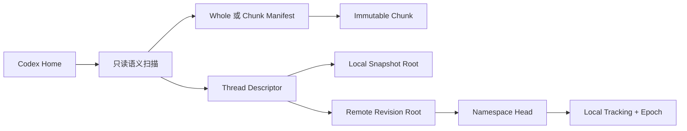

# Codex Session Sync v2 实施计划与完成记录

更新时间：2026-07-31
适用范围：开发期 v2-only；不实施 v1/v2 同步兼容，不实施跨平台发行打包。

## 1. 已确认的产品决策

1. Namespace 是同步单位，拥有稳定 UUID 和可重命名显示名。
2. Remote Revision 只保存不可变的 `RevisionRootV2` 图，不保存完整 Revision
   JSON 作为权威传输格式。
3. 不合并 SQLite 二进制文件；以 Thread Descriptor 和内容对象做语义导出、
   合并与受保护导入。
4. 删除先进入可恢复回收站；GC 第一阶段只进入隔离区，默认禁止永久删除。
5. Codex 必须完全退出后才能执行任何真实 Home 写入。
6. 开发期旧数据没有兼容价值，验证完成后可以只备份并重置
   `C:\Users\24989\.codex-session-sync` 和开发服务器数据；绝不触碰
   `C:\Users\24989\.codex`。

## 2. 目标架构



桌面端使用 Tauri 2、React、TypeScript；同步核心独立于 Tauri 和 HTTP；服务端
使用 Rust/Axum、SQLite 元数据和本地文件对象存储。对象存储通过适配器边界保留
未来接入 S3 的可能性。

## 3. v2 数据模型和目录

### 3.1 对象类型

- `Whole`：小内容的完整不可变对象。
- `ChunkManifest`：固定块大小的规范 JSON 清单。
- `Chunk`：大 rollout 的内容块。
- `Thread`：规范化 Thread Descriptor。
- `RevisionRoot`：Namespace、父 Revision、线程引用和摘要信息。

每个对象的身份是 `(StorageObjectKind, sha256)`；结构化对象必须是 canonical
JSON，服务端在读取和提交时再次验证 hash、长度、类型和所有边。

### 3.2 本地目录

```text
.codex-session-sync/
├─ objects/{whole,chunks,chunk-manifests,threads,revision-roots}/sha256/
├─ objects/tmp/
├─ snapshots/<uuid>.json
├─ metadata/snapshots/<uuid>.json
├─ backups/
├─ journal/
├─ trash/snapshots/<operation>/
├─ trash/gc/<operation>/
├─ quarantine/
└─ index/source-objects-v2.json
```

### 3.3 服务端元数据

`namespaces` 保存 Head 和 `namespace_epoch`；`revisions` 保存不可变摘要和
active/trashed 状态；`revision_roots` 建立 Revision 到 Root 的关系；
`storage_objects` 与 `object_edges` 用于全局可达性；`revision_trash_operations`
保存可恢复历史改写；`gc_queue` 保存持久化 GC 隔离队列。

## 4. 页面设计

### 4.1 同步页

采用 IDEA Git Log 风格三栏结构：

- 左侧 Source Tree：Working Tree、Tracking、远端 Namespace、冲突状态。
- 中间 Graph/Table：节点、分叉、`HEAD`/`TRACKING` 标签、父子版本线、时间、
  会话变化和对象大小。
- 底部 Details：摘要、Thread Diff、对象引用和 Push/Pull/Switch/Conflict 操作。

进入页面只刷新状态，不自动创建 Snapshot，不自动 Checkout。

### 4.2 快照与恢复页

顶层路由 `/history`，左树包括：

- 本地快照：手动/自动、标签、固定状态。
- 当前远端 Namespace：Revision 列表。
- 操作恢复：未完成 Import/Checkout Journal 自动置顶。
- 回收站：本地快照和远端历史。
- 对象 GC：容量摘要、计划和隔离操作。

所有列表均使用 Graph/Table 共享组件；选择行后显示详情与操作。删除按钮只会
生成删除计划并在二次确认后移入回收站。

## 5. 后端实施流程

### Phase 0：基线与安全边界

- 锁定 Rust 1.88、Tauri 2、Axum 和 SQLite 架构。
- 为真实 Home 写入保留进程检测、Home Lease、备份、Journal、回滚和验证。
- 所有自动化测试使用临时 Home、临时仓库和临时服务端数据。

### Phase 1：v2-only 存储

- 强制 `ContentRef.storage`；删除 v1 Snapshot 写入/优化路径。
- Snapshot 根与 Revision Root 分离；修复 Windows 文件名限制。
- Snapshot、Descriptor、Manifest、Chunk 和附件图完成递归校验。
- Source index 升级为 `source-objects-v2.json`；旧 `objects/sha256` 不再写入。

### Phase 2：紧凑远程协议

- `/api/v2/info` 宣布 v2 capabilities。
- Namespace、Head、Revision Summary、Typed Object API 全部使用 v2。
- Push 只上传缺失 typed objects，Commit 只提交 Root hash、`expectedHead` 和
  `expectedNamespaceEpoch`。
- 服务端在 SQLite CAS 前完整验证 Root 图；相同 Root 重试幂等，旧 Head/Epoch
  返回冲突。
- 删除桌面 v1 HTTP client、服务端 v1 路由、旧 RevisionStore 和 untyped 远程对象。

### Phase 3：Tracking Epoch

- Tracking schema 升级为 2，增加 `remote_epoch`。
- Push/Pull/Switch 检查 Epoch；历史改写后拒绝离线客户端覆盖新历史。
- 成功 Checkout、Push、Pull 后以 CAS 方式修复 Tracking 和 active namespace。

### Phase 4：快照历史和安全恢复

- 本地 Snapshot 列表、详情、比较、标签、固定、精确恢复。
- Snapshot 删除计划在执行前重新计算；固定快照和非终止 Journal 引用的快照不可删。
- Trash Journal 先落盘，再原子移动 Root/Metadata；恢复成功后清理 trash entry。
- Import/Checkout/Sync Journal 在启动和 UI 中都能被发现并显式恢复。

### Phase 5：仓库级并发控制

- Tauri JobManager 增加 repository shared/exclusive lease。
- 列表、验证、Snapshot 创建、Push/Pull 使用 shared lease。
- Trash、Metadata 变更、GC quarantine 使用 exclusive lease。
- Home Lease 仍负责真实 Codex Home 写入；不同 Home 可并行，同一 Home 串行。

### Phase 6：本地 GC 和容量统计

- Mark 根包括活动 Snapshot、Snapshot Trash、缓存的 Revision Root、非终止 Journal。
- Sweep 只扫描全局不可达 typed objects；执行前重新计算并比较计划指纹。
- 第一阶段只移动到 `trash/gc/<operation>`，不永久删除。
- 提供 logical、repository physical、active、shared、exclusive、trash、
  quarantine、reclaimable、journal-protected 字节统计。

### Phase 7：远端历史回收和服务端 GC

- History truncation 只允许把 Head 移到祖先或 `null`；每次改写递增 Epoch。
- 被截断 Revision 进入 30 天可恢复 trash；恢复使用 Head/Epoch CAS。
- `gc_queue` 持久化 pending/quarantined/cancelled 状态。
- GC 通过递归 `object_edges` 从所有活动 Revision 和未过期历史 Trash 标记全局根。
- GC 操作持有服务端独占 gate；提交/上传持有 shared gate；最近上传对象有安全宽限期。
- 进程重启时自动继续 pending queue；移动前再次确认对象未被任何 Namespace 引用。

### Phase 8：前端交互与 QA

- `/history` 和 `/sync` 共用 Graph Table、详情面板和响应式布局。
- 增加列表选择、删除确认、远端回退/删除、恢复点、GC 统计的 Vitest 覆盖。
- 通过桌面宽屏、390px 窄屏和 Vite preview 做视觉检查，页面不能产生级联横向溢出。

## 6. API 速查

```text
GET  /health
GET  /api/v2/info
GET/POST /api/v2/namespaces
PATCH /api/v2/namespaces/{id}
GET /api/v2/namespaces/{id}/head
GET /api/v2/namespaces/{id}/revisions
POST /api/v2/namespaces/{id}/revisions/commit
POST /api/v2/objects/missing
PUT/GET /api/v2/objects/{kind}/{sha256}
POST /api/v2/namespaces/{id}/history/truncations
GET /api/v2/namespaces/{id}/trash
POST /api/v2/namespaces/{id}/trash/{operation}/restore
GET /api/v2/storage
GET /api/v2/gc/plan
POST /api/v2/gc/quarantine
```

## 7. 测试验收矩阵

- `sync-core`：Whole/Chunk 往返、稳定 hash、Root 图校验、Snapshot 比较、共享对象
  GC、Trash 恢复、取消和 Journal 崩溃恢复。
- `sync-server`：认证零写入、typed hash/length 校验、Root 图校验、First Commit、
  Fast-forward、幂等重试、Head/Epoch CAS、历史 Trash、全局 GC、队列重启。
- `desktop`：双 Home Push/Pull、同线程冲突、Explicit Resolution、namespace switch、
  Home/Repository Lease、恢复点发现。
- `frontend`：Graph 行选择、Snapshot 删除确认、恢复点、GC 统计、窄屏布局。

## 8. 最终验证命令

```powershell
cargo fmt --all -- --check
cargo test --workspace
cargo check --workspace
cargo clippy --workspace --all-targets -- -D warnings

cd apps/desktop
npm run check
npm run build
npm test -- --run
```

## 9. 开发数据重置流程

仅在上面的命令全部通过后执行：

1. 确认 Codex 完全退出，确认目标是
   `C:\Users\24989\.codex-session-sync`，不是 `.codex`。
2. 将该目录移动为带时间戳的开发备份目录，不直接删除。
3. 只重置开发服务器 `data` 目录或 Compose 开发 volume。
4. 启动新 v2 服务端，使用真实 Home 只做只读扫描，再创建首个 Snapshot 和 Push。
5. 用临时第二 Home 做 Pull/Checkout/冲突回归。
6. 稳定后再决定是否永久删除开发备份；默认不自动永久清理对象或备份。

## 10. 当前完成定义

本计划的 v2 存储、紧凑协议、Namespace Epoch、IDEA 风格同步/历史 UI、本地/远端
回收站、仓库级租约、本地和服务端 GC、容量统计、恢复点发现及自动化测试均已实现。
跨平台安装包、签名、公证、自动更新和生产 HTTPS 部署不属于本次开发阶段。
